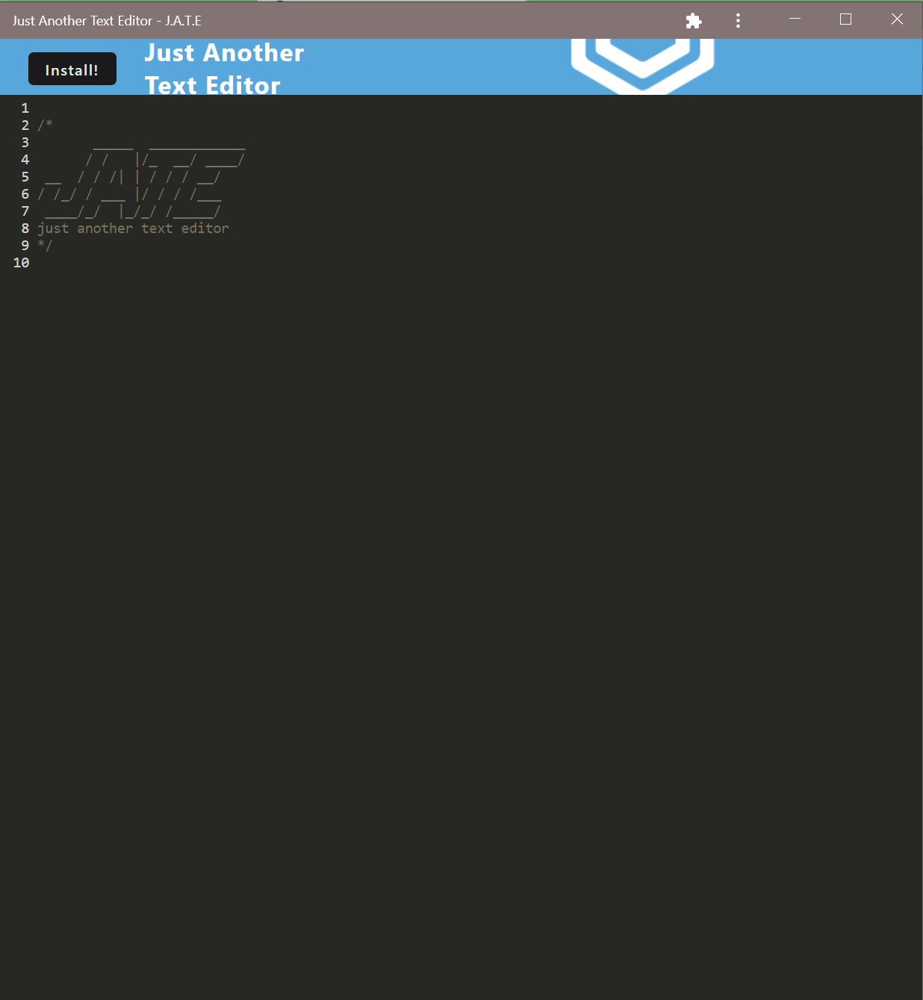

# Title
Just Another Text Editor

# Table of Contents
[Description](#description)

[Installation](#instalation)

[Usage](#usage)

[Heroku Link](#heroku)

[Contributors](#contributors)

[Tests](#tests)

[Questions](#questions)

## Description
A text editor that follows the PWA paradigm

## Installation
Clone the repository, and run script npm install to install all the dependencies, once done, run script npm start to start the server and use the application via the designated port

## Usage
A simple text editor that can be installed on the desktop for offlice use

## Heroku 
https://mighty-chamber-40948.herokuapp.com/

## Contribution
Mohammad Komol Hasan

## Questions
GitHub: MKHLink

Email: likhonhasankomol@gmail.com
    